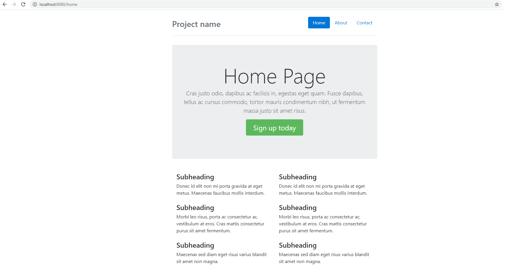

# web-app-template-k3d

Simple web app template written with Golang + Bootstrap 4 to be used to showcase the power of k3d
containerized application to a Kubernetes cluster.

## Usage

Install [Golang](https://golang.org/)  
Clone this repo and go to that folder

```bash
go run main.go
```

Default server run on port 8080(this is before deploying k3d cluster), browse to

[localhost:8080/home](http://localhost:8080/home)

Get result



## License

This repo is available as open source under the terms of the [MIT License](https://opensource.org/licenses/MIT).  
You are welcome to contribute!
# k3d-with-go
# go-webapp-with-k3d
Deploy the webapps to a local k3d cluster

## Containerizing the Application

irst, let’s create a file named Dockerfile at the project root and add the following commands there.
Dockerfile

# Base Image
FROM golang:1.17-alpine

# Make app directory
RUN mkdir /app

# Copy all content to the app directory
ADD . /app

# Make app directory the working directory
WORKDIR /app

# Download any required modules
RUN go mod download

# Build the program to create an executable binary
RUN go build -o webserver .

# Set the startup command
CMD ["/app/webserver"]

Using the “golang alpine” image for its compact size

ow let’s build the container using the build command while tagging it with the name “go-webapp.”


docker build -t go-webapp .

