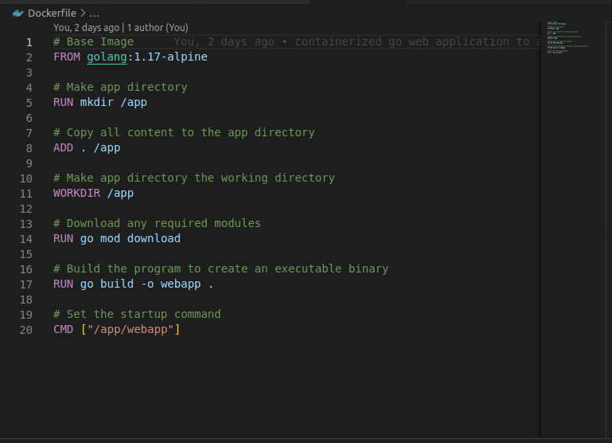
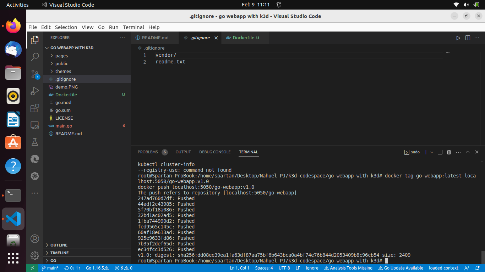
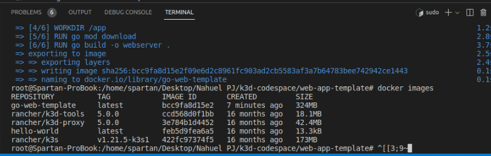
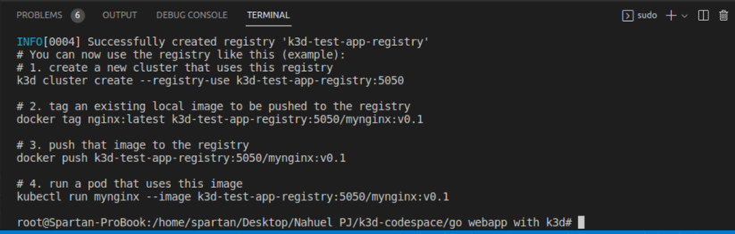
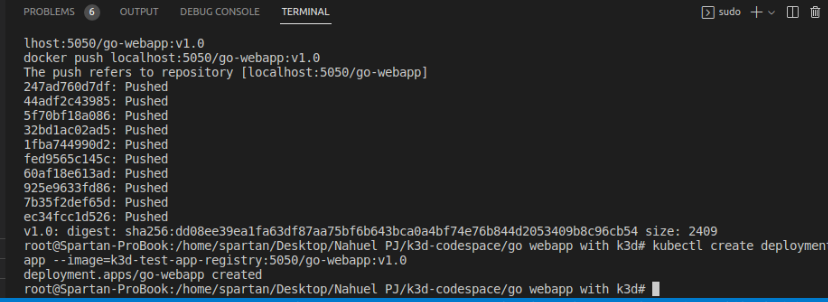
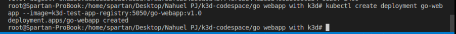
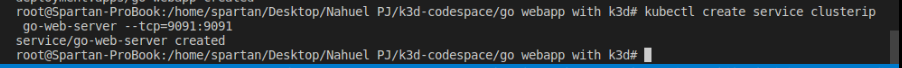
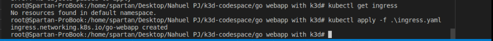

# web-app-template-k3d

Simple web app template written with Golang + Bootstrap 4 to be used to showcase the power of k3d
containerized application to a Kubernetes cluster.

## Usage

Install [Golang](https://golang.org/)  
Clone this repo and go to that folder

```bash
go run main.go
```

Default server run on port 8080(this is before deploying k3d cluster), browse to

[localhost:8080/home](http://localhost:8080/home)

Get result


## License

This repo is available as open source under the terms of the [MIT License](https://opensource.org/licenses/MIT).  
You are welcome to contribute!
# k3d-with-go
# go-webapp-with-k3d
Deploy the webapps to a local k3d cluster

## Containerizing the Application

First, let’s create a file named Dockerfile at the project root and add the following commands there.

# Dockerfile




Using the “golang alpine” image for its compact size

ow let’s build the container using the build command while tagging it with the name “go-webapp.”


>docker build -t go-webapp .

#Results




We can simply look at the images within docker using the image command and thereby verify the image creation.

>docker images

#RESULT



# Creating a Private Container Registry

The registry can be created using the registry create command. We will create a local private registry called “test-app-registry” using port 5050.

>k3d registry create test-app-registry --port 5050



K3d provides users with the necessary steps to create a K8s cluster and push the images.

Before creating the cluster, let’s create a file named registries.yaml that will define the registry config for the cluster. It will help to route the traffic to this private registry properly.

# registries.yaml

>mirrors:
>"localhost:5050":
>    endpoint:
>      - http://k3d-test-app-registry:5050
>

Then, we can use the following command to construct the cluster.
It will make use of the previously constructed container registry and a cluster load balancer on port 9900. 

> k3d cluster create mycluster -p "9900:80@loadbalancer" 
> --registry-use k3d-test-app-registry:5050 --registry-config registries.yaml

# Results


# Pushing the Docker image to the Private Container Registry

We are almost there,tag the image with the registry name and push the image to the “k3d-test-app-registry” . Tag and Push the Local Docker image  using the following commands.

>docker tag go-web-server:latest localhost:5050/go-web-server:v1.0
>docker push localhost:5050/go-web-server:v1.0



# Create a Deployment

Then we can construct a service to expose the deployment and deploy using our image.
Then, in order to grant access to it, we must create an ingress object. 

# Create the Deployment and Service

>kubectl create deployment go-webapp --image=k3d-test-app-registry:5050/go-webapp:v1.0

#Results



>kubectl create service clusterip go-web-server --tcp=9091:9091

 # RESULT



# Create Ingress Object

Create the following file and apply it using the kubectl apply command.

# ingress.yaml

>apiVersion: networking.k8s.io/v1
>kind: Ingress
>metadata:
>  name: go-web-server
>  annotations:
>    ingress.kubernetes.io/ssl-redirect: "false"
>spec:
>  rules:
>  - http:
>      paths:
>      - path: /
>        pathType: Prefix
>        backend:
>          service:
>            name: go-web-server
>            port:
>              number: 9091

>>kubectl apply -f .\ingress.yaml

# RESULT


Successfully deployed your containerized application to a Kubernetes cluster. The deployed web server will be visible if you visit the cluster URL http://localhost:9900/.